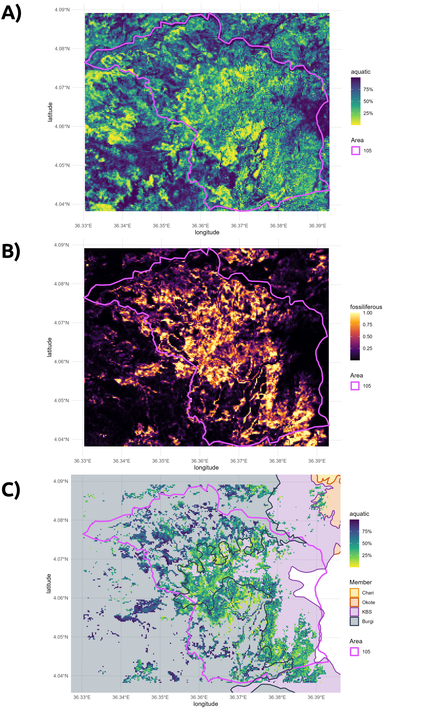

# TURKAQUA

*Geospatial paleoecology: estimating aquatic and terrestrial fossil abundance in East Lake Turkana*

## Available Files

- `0-LoadData.R`
The code performs preprocessing for environmental and geographical data, including reading and cropping satellite imagery, reconstructing DEM data, calculating vegetation indices, and preparing datasets for modeling by incorporating geological and bone walk data for the East Turkana region.

- `1-Model-A_BetaReg_bone_walks.R`
The code generates a bar plot depicting the percentage of aquatic fauna across different bonewalks, conducts beta regression modeling using environmental and geographical data, evaluates model performance through leave-one-out cross-validation, and assesses significance by generating and analyzing p-values from t-tests on random samples. The results are visualized through figures and statistical summaries.

- `2-Model-B_MaxEnt_filter.R`
The provided R code involves MaxEnt modeling and filtering for fossiliferous areas in East Turkana. It includes building a MaxEnt model, visualizing global predictions, filtering non-fossiliferous regions, and comparing MaxEnt and Beta Regression predictions. Additionally, it performs MaxEnt model validation using presence and absence data, computes evaluation metrics, and generates ROC curves. The results are saved as multiple figures, offering insights into the spatial distribution of fossiliferous areas and model performance.

- `3-Stats_Visualizations.R`
The code generates summary stats and visualizations comparing the MaxEnt and Beta Regression models in predicting fossil distribution. It includes boxplots of aquatic percentages across study areas and bar charts showing predictor contributions. The final multi-plot figure integrates these visualizations for model comparison.

- `4-Response_Plots.R`
The code generates response plots using ggplot2 for MaxEnt independent models and marginal response curves.

- `5-Generate_Figure_RawData.R`

The code turns Landsat 8 and DEM data into raster plots for East Turkana. It combines these spatial visualizations into a grid and exports the resulting figure as a PNG file.

## Results

**Study area geographic context.**
a) East Turkana as depicted in a preview of scene ID = LC81690572018036LGN00, Landsat 8 image from 2018-Feb- The dashed rectangle was the cropped section used in all analyses. Notice the image has no clouds on the region of interest;
b) the raw satellite image overlaid on its larger geographic context, covering part of northern Kenya and southern Ethiopia.

**All the layers of the stacked dataset used during training for predictive modelling.**

**“Bone walks” raw data.**
A) Geocoordinates of the points of interest (POI) over a map of the Paleontological Collection Areas (Brown and Feibel, 1990, revised by Bobe et al., 2022), also including the training extent of the models in a pink dashed rectangle, and three smaller rectangles with the Ileret (purple), Karari (teal), and Koobi Fora (yellow) sub-regions;
B) Ratio of aquatic-to-terrestrial fauna sampled by systematic bone walks in each POI.

**Outputs of the main models for the East Turkana region.**
A) aquatic-to-terrestrial ratio predictions;
B) estimated distribution of fossils;
C) final paleoenvironmental reconstruction based on BetaReg’s output filtered by MaxEnt.

**A test of the MaxEnt model using 1903 georeferenced fossil presences extracted from the PaleoTurkana database (Bobe et al., 2022); * - absences were generated by randomly selecting another set of 1903 xy points across the map.**

**Comparison of variable importance metrics** for A) BetaReg and B) Maxent, as calculated by percent contribution, as defined in varImp() function from R (Liaw and Wiener, 2002).

**Predictive modelling of Ileret:**
A) BetaReg with raw output before masking;
B) MaxEnt model predicting exposure of fossiliferous deposits;
C) PaleoEnv model overlapped by the geological members of the Koobi Fora Fm (Gathogo, 2003; Gathogo and Brown, 2006).

**Boxplot of PaleoEnv model outputs**, i.e., BetaReg predictions after MaxEnt masking. Each box width is relative to the total number of cells after filtering (i.e., total fossiliferous pixels). Fill color is the ratio of cells remaining by the total cells in each area (i.e., fossiliferous density). Diamonds are average means; and boxes are interquartile of aquatic ratio (25%; median; and 75%). Boxes are ordered from BetaReg’s median prediction of most terrestrial to most aquatic (after filtering by MaxEnt).

**Predictive models of Karari's Area 105**.
A) BetaReg output, before masking;
B) MaxEnt model predicting exposure of fossiliferous deposits;
C) PaleoEnv model with geological layers.

**Predictive models of Koobi Fora’s Area 103**.
A) BetaReg with raw output, before masking;
B) MaxEnt model predicting fossiliferous deposits;
C) PaleoEnv with geological layers.